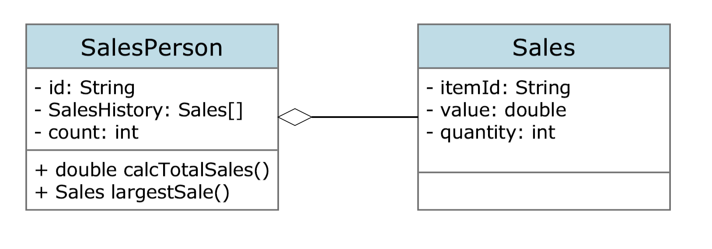
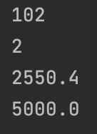

# Object Oriented Program

### Class Design and Implementation Case

Name: Clarissa Audrey Fabiola Kusnadi

Class: L2AC

NIM: 2602118490

###### 1.(a) By making use of an example from the above scenario, distinguish between a class and an instantiation of a class. (3 points)

A class is like the blueprint or the template for a certain type of object where attributes and methods are defined, whereas an instantation of a class actually refers to an object that is created based on that class, with its own set of attributes and ability to use the methods defined in the class.

Making use of an example from the above scenario, the class could be "Employee" defining the attributes and methods that all the employees in the company will have, like name, ID, number, and salary. Meanwhile, an instantation of the "Employee" class can be the object representing a specific employee in the company, such as "Priscilla Abigail" with an ID number of 54321 and a salary of $25,000 per year.


###### The different modules in the program each open a graphical user interface (GUI). Each GUI has a similar design but contains differences specific to each module.

###### (b) By giving two examples, explain how the principles of inheritance can be incorporated into the design of this administration program. (4 points)

Inheritance allows classes to inherit attributes and methods from parent classes. Two examples of using it on this administration program are:

- Creating a "Manager" class that could inherit common attributes and methods from the "Employee" class, like name and salary, while also adding additional attributes and methods specific to the Manager class.
- Similar to the first example, another example would be to create a "SalesPersonnel" class that could inherit common attributes and methods from the "Employee" class, while also adding additional attributes and methods specific to the SalesPersonnel class.


###### (c) Describe how the use of libraries can facilitate the development of programs like this company’s administration program. (3 points)

Libraries are collections of built in functions that can be used to save time instead of having to write all the codes from scratch, for example developers can use libraries to handle common tasks or functions, such as displaying a GUI or performing complex calculations. By using libraries, developers can save their time and resources to focus on the unique aspects of the program instead of having to reinvent the wheel for common tasks. 


###### 2. (a) Complete the constructor public SalesPerson(String id), from the SalesPerson class. (2 points)

```
public SalesPerson(String id) {
    this.id = id;
    this.salesHistory = new Sales[100];
}
```


###### (b) Explain why accessor methods are necessary for the SalesPerson class. (3 points)

Accessor are necessary for the SalesPerson class to provide controlled access to the private instance variables, allowing other classes to retrieve or manipulate the data without compromising encapsulation.


###### (c) (i) Construct unified modelling language (UML) diagrams to clearly show the relationship between the SalesPerson and Sales classes.

###### Note: There is no need to include mutator or accessor methods or a constructor. (4 points)




###### (c) (ii) Outline a negative effect that a future change in the design of the Sales object might have on this suite of programs. (2 points)

If there is a change in the design of the Sales object, it can lead to a corresponding changes for the SalesPerson class which could impact other classes in the suite of programs that rely on the SalesPerson class.  


###### (d) State the output after running this code. (4 points)




###### (e) Construct the method calcTotalSales(), in the SalesPerson class that calculates the total value of the sales for a specific SalesPerson object. (5 points)

*The following code can be found in the SalesPerson class

```
public double calcTotalSales() {
    //calculates total sales for the salesPerson
    double totalSales = 0;
    for (Sales sales : salesHistory) {
        if (sales != null) {
            totalSales += sales.getValue() * sales.getQuantity();
        }
    }
    return totalSales;
}
```


###### The salesPeople array contains 100 instantiated objects. The company wishes to reward the salesperson whose sales have the largest total value.

###### (f) By making use of any previously written methods, construct the method highest(), that returns the ID of the salesperson whose sales have the largest total value. (5 points)

*The following code can be found in the Main class

```
public static String highest(SalesPerson[] salesPeople) {
    double highestTotalSales = 0;
    String highestSalesPersonID = null;

    for (SalesPerson salesPerson : salesPeople) {
        if (salesPerson != null && salesPerson.calcTotalSales() > highestTotalSales) {
            highestTotalSales = salesPerson.calcTotalSales();
            highestSalesPersonID = salesPerson.getId();
        }
    }
    return highestSalesPersonID;
}
```


###### (g) Construct the method addSales(Sales s, String id), in the Driver class, that will add a new Sales object s, to the salesperson with a specified ID.

###### Note: You can assume that the ID is a valid one. (4 points)

*The following code can be found in the Main class

```
public static void addSales(Sales s, String id) {
    for (SalesPerson salesPerson : salesPeople) {
        if (salesPerson != null && salesPerson.getId() == id) {
            salesPerson.setSalesHistory(s);
            return;
        }
    }
}
```


###### (h) Suggest changes that must be made to the SalesPerson class and/or the Sales class to allow these calculations to be made. (3 points)

Changes that could be made is by adding a date variable in the class and in the constructor, along with its Getters and Setters. This will affect the CalcTotalSales function because the date variable will be taken into account in the function. 


###### (i) Discuss the use of polymorphism that occurs in this suite of programs. (3 points)

As seen by the use of two constructors with different parameter lists in the SalesPerson class, polymorphism that occurs in this suite of programs is overloading. 


